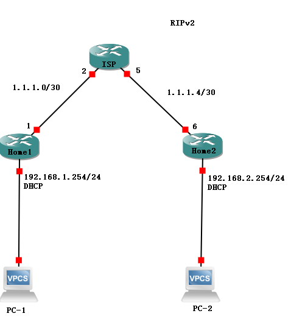

# GNS3 - 关于基于IPsec的Site To Site VPN 的搭建


**前提：全网通，PC-1可以Ping通PC-2**

1. Home1 - 配置isakmp协议
 ```GNS3
Home1(config)# // 现在开始配置isakmp协议
Home1(config)# crypto isakmp enable 	// 把isakmp打开，以免没有开启
Home1(config)# 							// isakmp 是一个密钥交换协议，属于IKE的子集
Home1(config)# crypto isakmp policy 10	// 规定isakmp协议的规则，优先级为10
Home1(config-isakmp)# authentication pre-share				// 设置认证方法为预共享密钥
Home1(config-isakmp)# encryption 3des	// 设置加密算法为3次des加密
Home1(config-isakmp)# group 5			// 设置DH组
Home1(config-isakmp)# exit
Home1(config)# crypto isakmp key 6 cisco address 1.1.1.6		// 设置预共享密钥为cisco，并指定对端IP为1.1.1.6
 Home1(config)# // isakmp协议配置完毕
```
2. Home1 - 配置IPsec
 ```GNS3
Home1(config)# // 现在开始配置IPSec
Home1(config)# crypto ipsec transform-set VPN-SET ah-sha-hmac esp-3des		// 创建一个新的叫做VPN-SET的转换集，作用为规定认证算法为sha加密，加密算法为3次des加密
Home1(cfg-crypto-trans)# exit	// 这里没啥好配置的就直接退出即可
 Home1(config)# // IPSec配置完毕
```
3. Home1 - 配置兴趣流
 ```GNS3
Home1(config)# // 现在开始配置ACL
Home1(config)# ip access-list extended IPSec		// 创建一个叫做IPSec的高级ACL列表
Home1(config-ext-nacl)# permit ip 192.168.1.0 0.0.0.255 192.168.2.0 0.0.0.255
Home1(config-ext-nacl)# // 添加一条规则，匹配源IP为192.168.1.0/24且目标IP为192.168.2.0/24的包
Home1(config-ext-nacl)#exit 
Home1(config)# // ACL配置完毕
 ```
4. Home1 - 配置映射组
 ```GNS3
Home1(config)# // 现在开始配置映射组
Home1(config)# crypto map VPN-MAP 10 ipsec-isakmp	// 创建一个名为VPN-MAP的映射，序号为10，使用isakmp协议
% 注意: 映射组将会被静止，直到配置了对等IP（peer）和兴趣流（match）
Home1(config-crypto-map)# match address IPSec		// 配置兴趣流为之前设置的ACL
Home1(config-crypto-map)# set peer 1.1.1.6			// 设置对等IP为1.1.1.6
Home1(config-crypto-map)# set pfs group5			// 设置向前保密算法复杂度
Home1(config-crypto-map)# set transform-set VPN-SET	// 设置转换集
Home1(config-crypto-map)# exit
Home1(config)# // 映射组配置完毕
 ```
5. Home1 - 绑定端口
 ```GNS3
Home1(config)# // 现在开始绑定端口
Home1(config)# interface fastEthernet 0/0
Home1(config-if)# crypto map VPN-MAP	// 将映射组与端口进行绑定
Home1(config)# // 端口绑定完毕
 ```
 1. Home1 - 配置isakmp协议
 ```GNS3
Home1(config)# // 现在开始配置isakmp协议
Home1(config)# crypto isakmp enable 	// 把isakmp打开，以免没有开启
Home1(config)# 							// isakmp 是一个密钥交换协议，属于IKE的子集
Home1(config)# crypto isakmp policy 10	// 规定isakmp协议的规则，优先级为10
Home1(config-isakmp)# authentication pre-share				// 设置认证方法为预共享密钥
Home1(config-isakmp)# encryption 3des	// 设置加密算法为3次des加密
Home1(config-isakmp)# group 5			// 设置DH组
Home1(config-isakmp)# exit
Home1(config)# crypto isakmp key 6 cisco address 1.1.1.6		// 设置预共享密钥为cisco，并指定对端IP为1.1.1.6
 Home1(config)# // isakmp协议配置完毕
```
2. Home1 - 配置IPsec
 ```GNS3
Home1(config)# // 现在开始配置IPSec
Home1(config)# crypto ipsec transform-set VPN-SET ah-sha-hmac esp-3des		// 创建一个新的叫做VPN-SET的转换集，作用为规定认证算法为sha加密，加密算法为3次des加密
Home1(cfg-crypto-trans)# exit	// 这里没啥好配置的就直接退出即可
 Home1(config)# // IPSec配置完毕
```
3. Home1 - 配置兴趣流
 ```GNS3
Home1(config)# // 现在开始配置ACL
Home1(config)# ip access-list extended IPSec		// 创建一个叫做IPSec的高级ACL列表
Home1(config-ext-nacl)# permit ip 192.168.1.0 0.0.0.255 192.168.2.0 0.0.0.255
Home1(config-ext-nacl)# // 添加一条规则，匹配源IP为192.168.1.0/24且目标IP为192.168.2.0/24的包
Home1(config-ext-nacl)#exit 
Home1(config)# // ACL配置完毕
 ```
4. Home1 - 配置映射组
 ```GNS3
Home1(config)# // 现在开始配置映射组
Home1(config)# crypto map VPN-MAP 10 ipsec-isakmp	// 创建一个名为VPN-MAP的映射，序号为10，使用isakmp协议
% 注意: 映射组将会被静止，直到配置了对等IP（peer）和兴趣流（match）
Home1(config-crypto-map)# match address IPSec		// 配置兴趣流为之前设置的ACL
Home1(config-crypto-map)# set peer 1.1.1.6			// 设置对等IP为1.1.1.6
Home1(config-crypto-map)# set pfs group5			// 设置向前保密算法复杂度
Home1(config-crypto-map)# set transform-set VPN-SET	// 设置转换集
Home1(config-crypto-map)# exit
Home1(config)# // 映射组配置完毕
 ```
5. Home1 - 绑定端口
 ```GNS3
Home1(config)# // 现在开始绑定端口
Home1(config)# interface fastEthernet 0/0
Home1(config-if)# crypto map VPN-MAP	// 将映射组与端口进行绑定
Home1(config)# // 端口绑定完毕
 ```
 **下面开始配置Home2，除了对端IP和兴趣流不同以外其他基本相同**
 1. Home2 - 配置isakmp协议
 ```GNS3
Home2(config)# // 现在开始配置isakmp协议
Home2(config)# crypto isakmp enable 	// 把isakmp打开，以免没有开启
Home2(config)# 							// isakmp 是一个密钥交换协议，属于IKE的子集
Home2(config)# crypto isakmp policy 10	// 规定isakmp协议的规则，优先级为10
Home2(config-isakmp)# authentication pre-share				// 设置认证方法为预共享密钥
Home2(config-isakmp)# encryption 3des	// 设置加密算法为3次des加密
Home2(config-isakmp)# group 5			// 设置DH组
Home2(config-isakmp)# exit
Home2(config)# crypto isakmp key 6 cisco address 1.1.1.1		// 设置预共享密钥为cisco，并指定对端IP为1.1.1.6
 Home1(config)# // isakmp协议配置完毕
```
2. Home2 - 配置IPsec
 ```GNS3
Home2(config)# // 现在开始配置IPSec
Home2(config)# crypto ipsec transform-set VPN-SET ah-sha-hmac esp-3des		// 创建一个新的叫做VPN-SET的转换集，作用为规定认证算法为sha加密，加密算法为3次des加密
Home2(cfg-crypto-trans)# exit	// 这里没啥好配置的就直接退出即可
Home2(config)# // IPSec配置完毕
```
3. Home2 - 配置兴趣流
 ```GNS3
Home2(config)# // 现在开始配置ACL
Home2(config)# ip access-list extended IPSec		// 创建一个叫做IPSec的高级ACL列表
Home2(config-ext-nacl)# permit ip 192.168.2.0 0.0.0.255 192.168.1.0 0.0.0.255
Home2(config-ext-nacl)# // 添加一条规则，匹配源IP为192.168.2.0/24且目标IP为192.168.1.0/24的包
Home2(config-ext-nacl)#exit 
Home2(config)# // ACL配置完毕
 ```
4. Home2 - 配置映射组
 ```GNS3
Home2(config)# // 现在开始配置映射组
Home2(config)# crypto map VPN-MAP 10 ipsec-isakmp	// 创建一个名为VPN-MAP的映射，序号为10，使用isakmp协议
% 注意: 映射组将会被静止，直到配置了对等IP（peer）和兴趣流（match）
Home2(config-crypto-map)# match address IPSec		// 配置兴趣流为之前设置的ACL
Home2(config-crypto-map)# set peer 1.1.1.1			// 设置对等IP为1.1.1.1
Home2(config-crypto-map)# set pfs group5			// 设置向前保密算法复杂度
Home2(config-crypto-map)# set transform-set VPN-SET	// 设置转换集
Home2(config-crypto-map)# exit
Home2(config)# // 映射组配置完毕
 ```
5. Home2 - 绑定端口
 ```GNS3
Home2(config)# // 现在开始绑定端口
Home2(config)# interface fastEthernet 0/0
Home2(config-if)# crypto map VPN-MAP	// 将映射组与端口进行绑定
Home2(config)# // 端口绑定完毕
 ```
 
